# IEEE-CIS Fraud Detection — Full Project Report

**Dataset:** Vesta Corporation / IEEE-CIS Fraud Detection (Kaggle)  
**Pipeline:** Data Engineering → EDA → Feature Engineering → Modelling → Anomaly Detection → Business-Cost Analysis  
**Models:** Logistic Regression · XGBoost

---

## Table of Contents

1. [Problem Statement](#1-problem-statement)
2. [Dataset](#2-dataset)
3. [Exploratory Data Analysis](#3-exploratory-data-analysis)
4. [Feature Engineering](#4-feature-engineering)
5. [Feature Selection](#5-feature-selection)
6. [Train / Validation / Test Split](#6-train--validation--test-split)
7. [Models](#7-models)
8. [Final Results](#9-final-results)
9. [Business-Cost Analysis](#10-business-cost-analysis)
10. [Conclusions & Recommendations](#11-conclusions--recommendations)

---

## 1. Problem Statement

Credit card fraud is one of the highest-impact financial crimes, causing global losses exceeding $30 billion annually. The challenge is inherently adversarial: fraud patterns evolve continuously, ground-truth labels are expensive and delayed (chargebacks arrive weeks after the transaction), and the class imbalance is extreme.

**The core tension:** detecting fraud is asymmetric.

- A **false negative** (missed fraud) costs the full transaction amount — the bank absorbs the chargeback loss.
- A **false positive** (legitimate transaction flagged) costs analyst review time and risks customer friction or churn.

The goal of this project is to build a complete, production-grade pipeline that:

1. Accurately distinguishes fraudulent from legitimate transactions using structured features
2. Provides an interpretable, deployable model with calibrated probabilities
3. Uses an unsupervised anomaly detector to catch fraud patterns the supervised model may miss
4. Translates model performance into actionable business cost curves, allowing threshold selection based on real operational constraints

---

## 2. Dataset

### Source

The **IEEE-CIS Fraud Detection** dataset was released by Vesta Corporation in collaboration with the IEEE Computational Intelligence Society, hosted as a Kaggle competition in 2019.

| Table                   |    Rows | Key Columns                                                                                                        |
| ----------------------- | ------: | ------------------------------------------------------------------------------------------------------------------ |
| `train_transaction.csv` | 590,540 | TransactionID, TransactionDT, TransactionAmt, ProductCD, card1–6, addr1–2, C1–C14, D1–D15, M1–M9, V1–V339, isFraud |
| `train_identity.csv`    | 144,233 | TransactionID, id_01–id_38, DeviceType, DeviceInfo                                                                 |

- **Transaction table:** 590,540 rows — card metadata, email domains, time deltas, count features, and 339 masked Vesta features (V-columns)
- **Identity table:** 144,233 matching identity records — device info, browser/OS fingerprints, masked network attributes

### Merge Strategy

We joined on `TransactionID` using a **left join anchored to the identity table**, producing the **identity-joined view of 144,233 rows × 434 columns**. This is the standard approach in top competition solutions because:

1. Identity features (device, browser, IP-derived signals) are among the strongest fraud predictors
2. Dropping unmatched rows removes a large fraction of low-risk transactions, making the problem better-conditioned
3. The fraud rate in the identity-joined view (8.69%) is higher than in the full transaction view (~3.5%) — fraudsters leave more digital traces

---

## 3. Exploratory Data Analysis

### 3.1 Class Imbalance

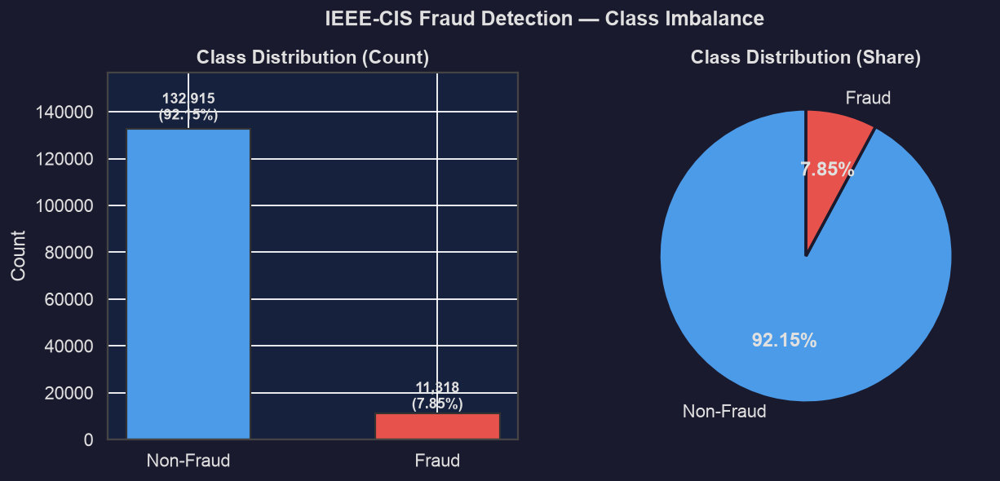

The dataset contains **132,915 legitimate** and **11,318 fraudulent** transactions — a **1 : 11.7 class ratio** (7.85% fraud rate). We handled this with two complementary strategies:

- **Supervised models:** `class_weight='balanced'` (LR) and `scale_pos_weight=12.41` (XGBoost, derived from the train split: 105,660 legit / 8,514 fraud) — re-weight the loss without altering the training distribution
- **Autoencoder:** trains only on non-fraud rows, making imbalance irrelevant by design

### 3.2 Missingness Analysis

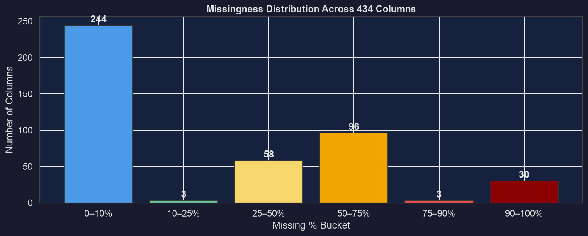

Missingness is extreme and structured:

- **57% of columns have >50% missing values** — predominantly D-columns and V-columns, populated only for specific transaction types
- **21 columns are 100% null** in the identity-joined view → dropped entirely
- Fully observed: TransactionAmt, TransactionDT, all C-columns, card4/card6/card3/card5

A critical finding: **missingness is not random with respect to fraud**:

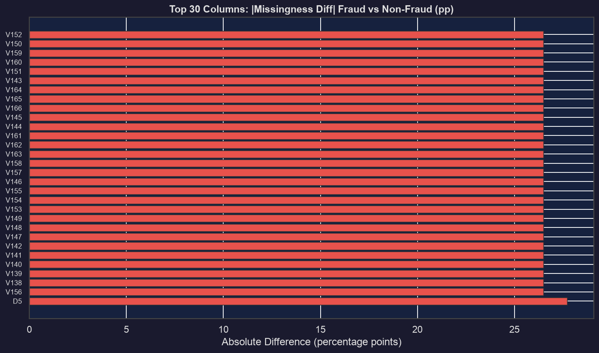

Several columns show 20–27 percentage-point null-rate differences between fraud and non-fraud rows:

- `D5`: 51.5% null in fraud vs 79.2% in legitimate → D5 **presence** is a fraud signal
- `V138–V157` block: 67.8% null in fraud vs 41.3% in legitimate → block **absence** is a fraud signal

This motivated explicit **missingness-as-signal flag features**.

### 3.3 Transaction Amount Distribution

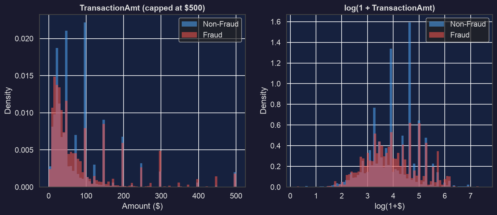

TransactionAmt is heavily right-skewed. On log scale:

- Distributions partially overlap, but fraud concentrates at specific amount bands
- Very low (<$10) and very high (>$1,000) amounts are both over-represented in fraud
- Median fraudulent amount ($55) is higher than legitimate ($45), but the mean is pulled up by large-value events

### 3.4 Card and Product Categorical Features

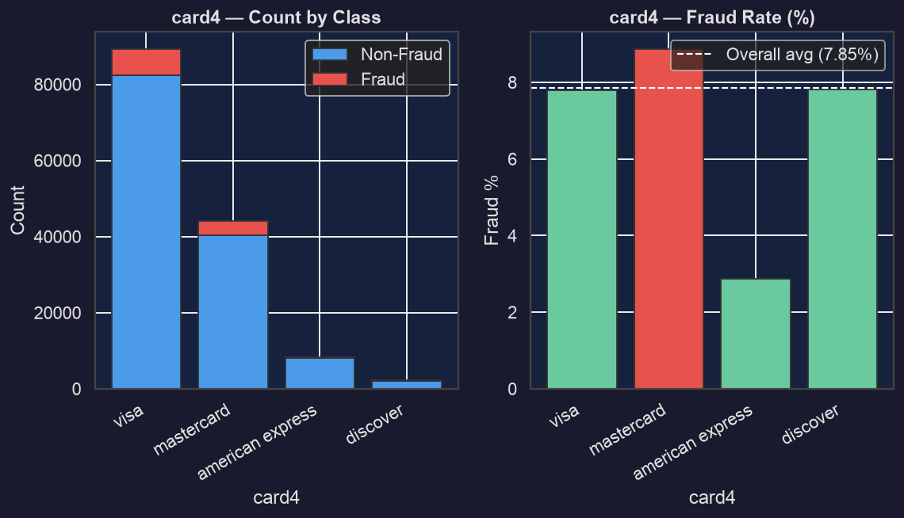

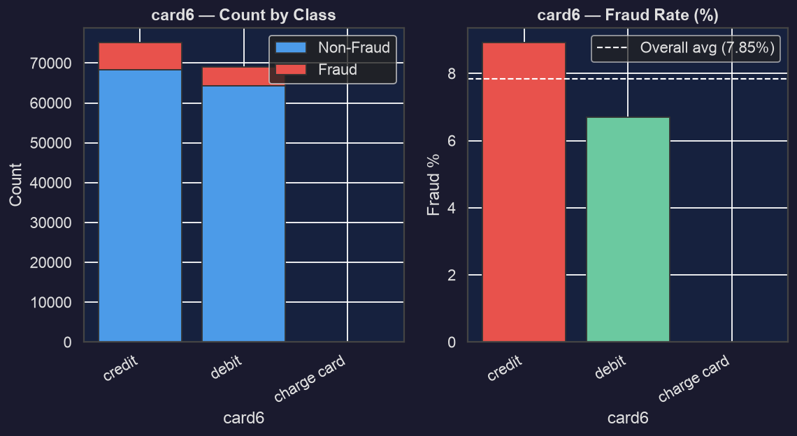

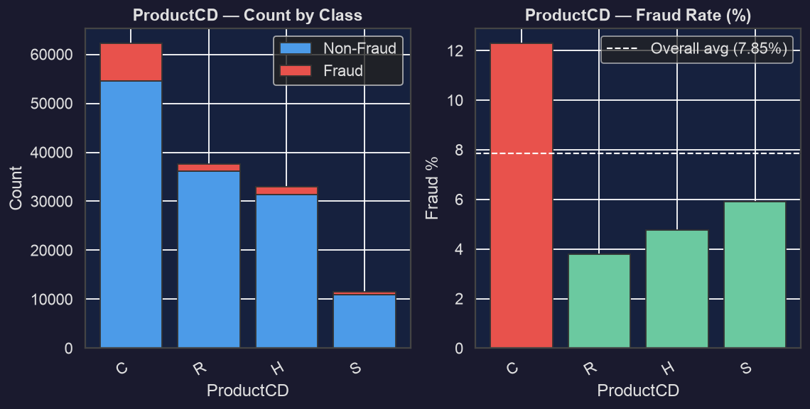

- **card4:** Discover cards have ~15% fraud rate vs Visa/Mastercard at ~8%
- **card6:** Debit cards have notably higher fraud rates than credit cards (fraudsters prefer debit for faster cash-out)
- **ProductCD:** Category `C` has ~12% fraud rate vs the overall ~8.7%; categories `H` and `S` are cleaner

### 3.5 Device and Identity Features

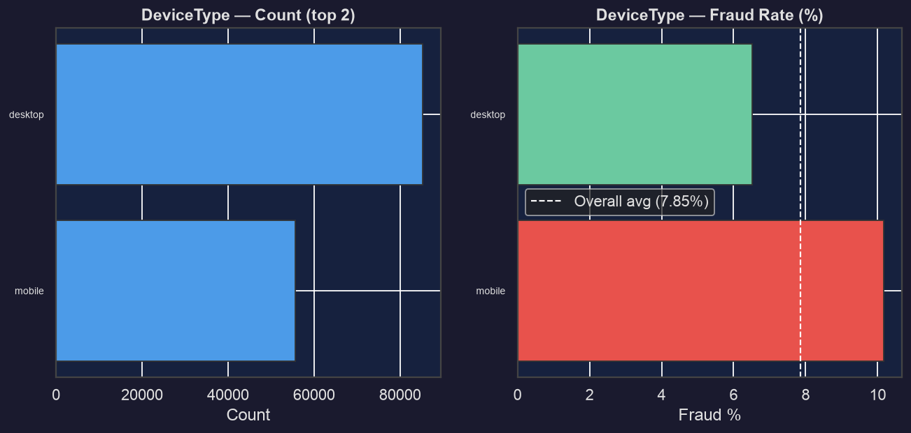

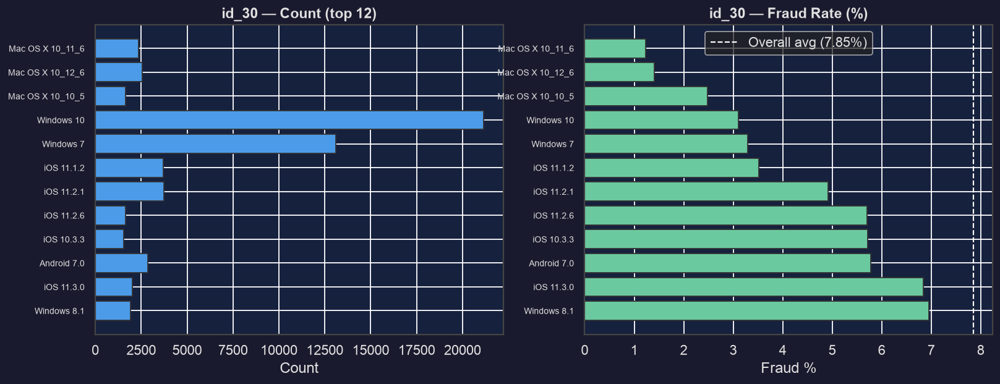

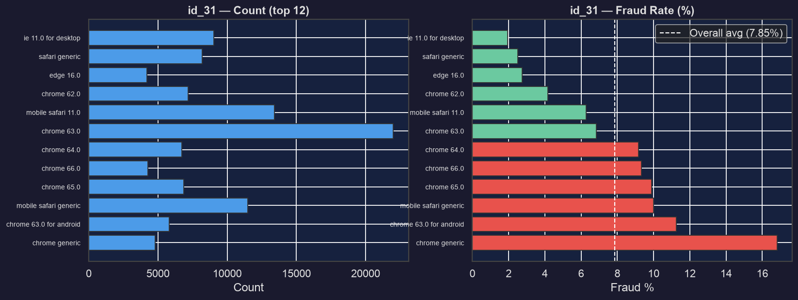

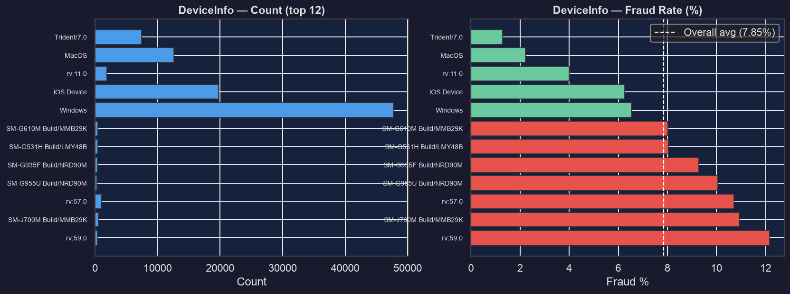

- Mobile transactions show higher fraud rates than desktop — consistent with card-not-present fraud
- Certain OS versions (older Android, some Windows builds) are associated with elevated fraud
- Rare browsers and device strings are disproportionately fraudulent — suggesting bot/emulator activity

### 3.6 Temporal Analysis — Fraud Rate Over Time

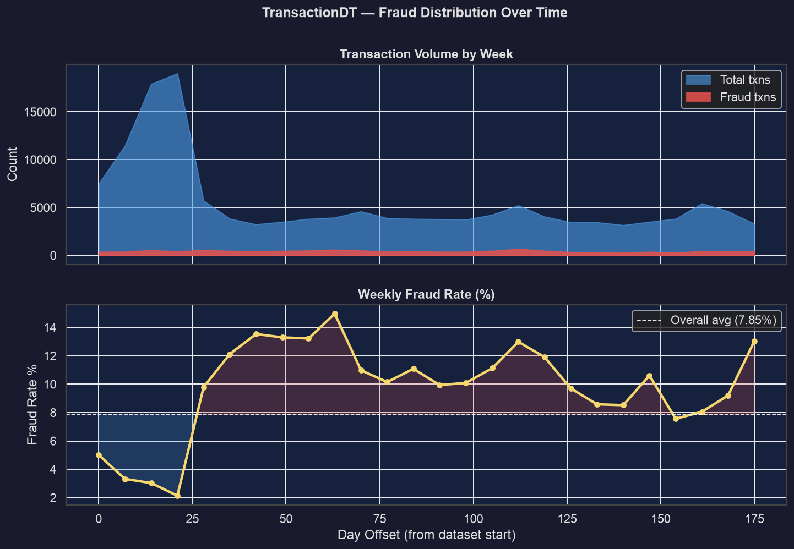

**Fraud rate is non-stationary.** It starts at ~4% in the first 3 weeks and rises sharply to ~12% by the end of the 182-day window — a **3× increase**. This has direct modelling implications:

1. **Random train/test splits are invalid** — they leak future fraud patterns into training
2. **Forward-chaining temporal splits are mandatory**
3. **Models must be periodically re-calibrated** — a threshold optimal in month 1 is miscalibrated by month 6

### 3.7 V-Column Analysis

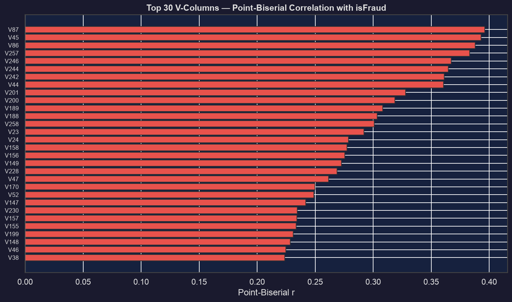

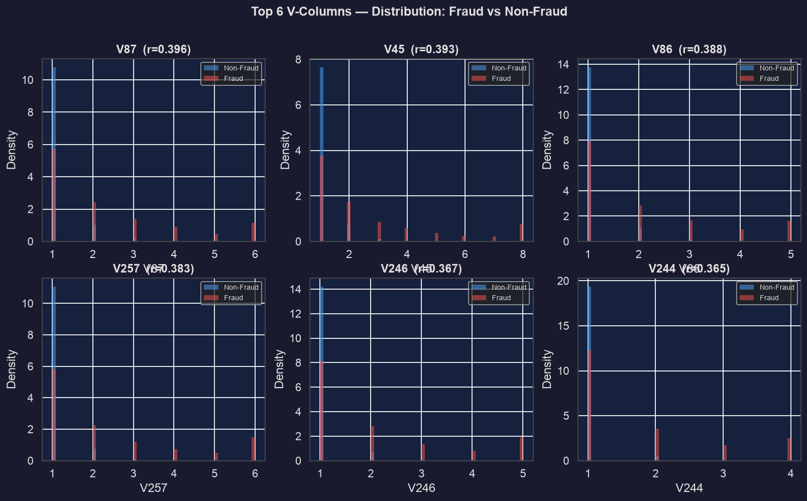

The 339 V-columns are Vesta's proprietary masked features — undocumented but powerful. They form **correlated blocks** (red clusters in the heatmap), suggesting they encode related signals at different aggregation levels. `V45`, `V258`, `V257`, `V187`, `V200`, `V242–V246` show the highest correlation with fraud and all appeared in the final top-30 feature set.

---

## 4. Feature Engineering

Starting from the 144,233 × 434 base dataset, five engineering steps produced a **144,233 × 437** enriched dataset.

### 4.1 UID Construction — Synthetic Entity Identifier

```
uid = card1 + "_" + card2 + "_" + addr1 + "_" + round(D1)
```

| UID Statistic                       |          Value |
| ----------------------------------- | -------------: |
| Unique UIDs                         |         27,848 |
| Average transactions per UID        |            5.2 |
| Singleton UIDs (1 transaction only) | 18,707 (67.2%) |
| High-volume UIDs (>5 transactions)  |          2,097 |
| Maximum transactions on one UID     |        **648** |

The heavy tail (648 txns on one entity) fingerprints **fraud ring activity**. Two-thirds of UIDs are singletons, but the active minority provides rich velocity-based signals.

### 4.2 D-Column Normalisation — Removing Time Drift

D-columns represent day-deltas (days since last login, account creation, etc.). Raw D-values **increase monotonically across the dataset** because `TransactionDT` is a cumulative second-offset — a model trained on raw D-values learns spurious time-position correlations.

**Fix:**

```
D_n_norm = D_n − (TransactionDT / 86400)
```

This converts drifting absolute values into stable relative deltas. 14 normalised columns created.

|         | Before                        | After                          |
| ------- | ----------------------------- | ------------------------------ |
| Mean D1 | 29.3 (drifting over 182 days) | −42.0 (stable reference delta) |

### 4.3 Frequency Encoding — High-Cardinality Categoricals

Replace each category value with its proportion in the training set:

| Column                        | Unique Values |  Null %   |
| ----------------------------- | :-----------: | :-------: |
| card1                         |     8,499     |   0.0%    |
| DeviceInfo                    |     1,786     |   17.7%   |
| id_31 (browser)               |      130      |   2.7%    |
| id_30 (OS)                    |      75       |   46.2%   |
| P_emaildomain / R_emaildomain |    59 / 60    |    ~9%    |
| card2 / addr1                 |   482 / 255   | <1% / 42% |

10 frequency-encoded columns added. Missing values encoded as 0.0 (treat unknown as maximally rare).

### 4.4 Missingness-as-Signal Flags

Binary `isnull_*` indicators created for 21 columns where null% differs >5pp between fraud and legitimate rows:

| Flag                        | Fraud null% | Legit null% |    Δ    | Direction                         |
| --------------------------- | :---------: | :---------: | :-----: | --------------------------------- |
| `isnull_D5`                 |    51.5%    |    79.2%    | −27.7pp | D5 **present** → fraud signal     |
| `isnull_V138`…`isnull_V157` |    67.8%    |    41.3%    | +26.5pp | V-block **absent** → fraud signal |

### 4.5 Drop 100%-Null Columns

21 columns entirely null: `D11`, `M1–M3`, `M5–M9`, `V1–V11`, `dist1` — removed.

### 4.6 Summary

| Step                       | Columns Added | Columns Removed |        Net        |
| -------------------------- | :-----------: | :-------------: | :---------------: |
| UID                        |      +1       |        —        |        +1         |
| Null flags                 |      +21      |        —        |        +21        |
| Drop 100%-null             |       —       |       −21       |        −21        |
| Drop raw D1–D15            |       —       |       −14       |        −14        |
| Drop high-card raws        |       —       |       −8        |        −8         |
| **Final engineered shape** |               |                 | **144,233 × 437** |

---

## 5. Feature Selection

### Method: Mutual Information (MI)

MI between each feature and `isFraud` was computed **on the train split only** — computing on val/test constitutes data leakage.

|                                      |  Count |
| ------------------------------------ | -----: |
| Features with MI = 0 (pure noise)    |     20 |
| Features with MI > 0.001             |    333 |
| Features with MI > 0.01 (meaningful) |    182 |
| **Selected: top 30 by MI**           | **30** |

### Top 30 Features

| Rank  | Feature                                                                               |  MI Score   | Type                                 |
| :---: | ------------------------------------------------------------------------------------- | :---------: | ------------------------------------ |
|   1   | `id_02`                                                                               |   0.2358    | Identity (undocumented Vesta column) |
|   2   | `C1`                                                                                  |   0.0820    | Count feature                        |
|   3   | `D1_norm`                                                                             |   0.0617    | Normalised day-delta                 |
|   4   | `C11`                                                                                 |   0.0580    | Count feature                        |
|   5   | `V258`                                                                                |   0.0554    | Vesta masked feature                 |
|   6   | `TransactionAmt`                                                                      |   0.0537    | Transaction amount                   |
|   7   | `D12_norm`                                                                            |   0.0535    | Normalised day-delta                 |
|   8   | `C2`                                                                                  |   0.0534    | Count feature                        |
| 9–14  | D14, D6, D4, V257, C6, D15_norm                                                       | 0.050–0.052 | Mixed                                |
| 15–30 | D13, D10, V201, V246, D7, C4, D5, V243, V200, C12, V187, V244, C7, V45, C8, V242_norm | 0.041–0.048 | Mixed                                |

**Notable:** `id_02` has 3× higher MI than the next feature. All normalised D-columns appear in the top half, validating the normalisation step. C-columns are uniformly strong and fully observed (0% null).

---

## 6. Train / Validation / Test Split

### Forward-Chaining Temporal Split

```
Train  : TransactionDT < 70th pct of time range  (Days 0–127)
Val    : 70th – 85th percentile                   (Days 127–155)
Test   : 85th – 100th percentile                  (Days 155–182, held out)
```

| Split          |    Rows | Fraud Rate | Day Range |
| -------------- | ------: | :--------: | :-------: |
| **Train**      | 114,174 | **7.457%** |   0–127   |
| **Validation** |  13,225 | **9.671%** |  127–155  |
| **Test**       |  16,834 | **9.059%** |  155–182  |

> The 79/9/11 row distribution (vs intended 70/15/15) reflects non-uniform transaction density over time — the temporal cut points are exact.

The fraud rate shifts (7.5% → 9.7% → 9.1%) are real distributional shifts driven by concept drift, not artefacts. Models must account for this.

---

## 7. Models

### 7.1 Logistic Regression — Interpretable Baseline

**Configuration:**

- `StandardScaler` (LR requires feature scaling)
- `class_weight='balanced'`, `C=0.1` (L2 regularisation), `solver='lbfgs'`
- NaN imputation: train-split column medians (fit once, applied to val/test)

**Rationale:** LR's linear boundary provides the ceiling on what linear feature combinations achieve. Any nonlinear model that doesn't substantially beat it isn't justifying its complexity. LR also has regulatory appeal — interpretable coefficients and calibrated probabilities.

**Validation results:**

| Metric            |  Value |
| ----------------- | -----: |
| AUC-ROC           | 0.7709 |
| PR-AUC            | 0.5115 |
| F1 (fraud)        | 0.3985 |
| Precision (fraud) | 0.2927 |
| Recall (fraud)    | 0.6239 |

LR captures 62% of fraud but only 1 in 3 flags is genuine — the classic precision-recall tradeoff under a linear model with severe imbalance.

---

### 7.2 XGBoost — Primary Supervised Model

**Configuration:**

- `scale_pos_weight = 105,660 / 8,514 = 12.41` — re-weights the gradient, penalising false negatives
- `n_estimators=1000`, early stopping patience=50 on val PR-AUC
- `max_depth=6`, `subsample=0.8`, `colsample_bytree=0.8`
- `tree_method='hist'` — fast histogram splits for 100k+ rows
- Native NaN handling — no imputation required

**Training:** Stopped at iteration **144**. Best validation PR-AUC reached in <150 iterations — fast convergence due to the informative top-30 feature set.

**Validation results:**

| Metric            |      Value |
| ----------------- | ---------: |
| AUC-ROC           | **0.8694** |
| PR-AUC            | **0.6395** |
| F1 (fraud)        | **0.5421** |
| Precision (fraud) | **0.4480** |
| Recall (fraud)    | **0.6865** |

**Feature importances (Gain) vs MI rank:**

| XGB Rank | Feature             |    Gain |      MI Rank       |
| :------: | ------------------- | ------: | :----------------: |
|    1     | V258                |   862.9 |         #5         |
|    2     | C1                  |   791.3 |         #2         |
|    3     | V257                |   259.9 |        #12         |
|    4     | C11                 |   221.1 |         #4         |
|    5     | D1_norm             |   166.4 |         #3         |
|    6     | C12                 |   136.4 |        #24         |
|   7–10   | V243, V244, C7, V45 | 114–132 | #22, #26, #27, #28 |

`id_02` drops from MI rank #1 to XGB gain rank #23 — tree-based splits, which capture interactions natively, value it far less than marginal MI suggests. V-columns that MI underrated (V243, V244) jump significantly in the gain ranking.

---

## 8. Final Results

### Test Set Evaluation

The test set (16,834 rows, fraud = 9.059%) was opened **once, at the very end**, after all modelling decisions were frozen.

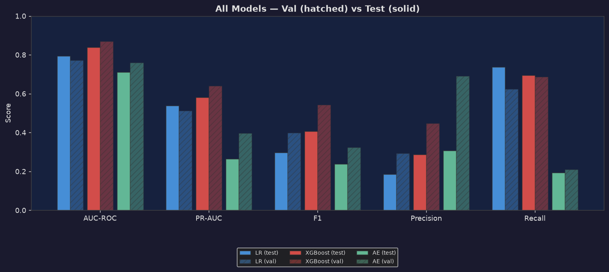

### Three-Model Comparison — Validation vs Test

| Metric    | LR (Val) | LR (Test)  | XGB (Val)  | XGB (Test) |
| --------- | :------: | :--------: | :--------: | :--------: |
| AUC-ROC   |  0.7709  |   0.7931   | **0.8694** | **0.8386** |
| PR-AUC    |  0.5115  |   0.5378   | **0.6395** | **0.5810** |
| F1        |  0.3985  |   0.2968   | **0.5421** | **0.4069** |
| Precision |  0.2927  |   0.1858   |   0.4480   |   0.2877   |
| Recall    |  0.6239  | **0.7370** | **0.6865** |   0.6951   |

### Val → Test Shift Analysis

| Metric    |    LR Δ    | XGB Δ  |
| --------- | :--------: | :----: | ------ |
| AUC-ROC   | **+0.022** | −0.031 |
| PR-AUC    | **+0.026** | −0.059 |
| F1        |   −0.102   | −0.135 | −0.084 |
| Precision |   −0.107   | −0.160 |
| Recall    |   +0.113   | +0.009 |

**Shift interpretation:**

- **LR improves on AUC** — its linear boundary generalises well across the mild distribution shift. Under-complex models don't overfit val-period idiosyncrasies.
- **XGBoost declines modestly** (−3pp AUC-ROC) — gradient-boosted trees captured some val-specific patterns. The drop is small; XGBoost remains the clear leader.

### Model Selection Rationale

| Model                   | Strengths                                                    | Weaknesses                             | Best For                                  |
| ----------------------- | ------------------------------------------------------------ | -------------------------------------- | ----------------------------------------- |
| **Logistic Regression** | Interpretable, fast, stable, improves on test                | Low AUC, misses nonlinear interactions | Regulatory review, interpretability-first |
| **XGBoost**             | Best AUC/PR-AUC, handles NaN natively, captures interactions | Slight val→test decay                  | Primary production scorer                 |

**Recommended production architecture:**

- XGBoost as primary scorer → standard review queue

---

## 9. Business-Cost Analysis

### Cost Model

| Event                         | Cost                                                |
| ----------------------------- | --------------------------------------------------- |
| False Negative (missed fraud) | Full `TransactionAmt` — bank absorbs the chargeback |
| False Positive (false alarm)  | $3.00 review + 2% × $50 churn = **$4.00 flat**      |
| True Positive / True Negative | $0                                                  |

> **Illustrative only.** Production deployment requires empirical chargeback data, measured analyst review times, and A/B-tested customer LTV estimates.

### Extended Threshold Sweep — 0.02 to 0.70

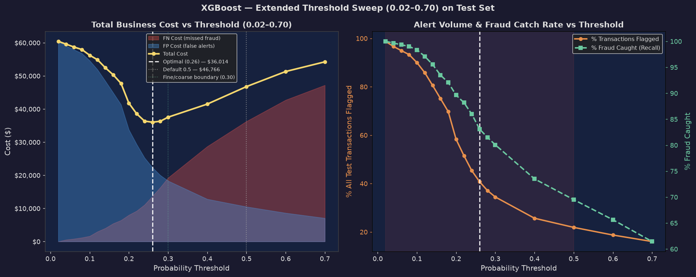

19 threshold values swept:

| Threshold |    TP     |    FP     |   FN    |  Total Cost   |  Fraud%   | Flagged%  |
| :-------: | :-------: | :-------: | :-----: | :-----------: | :-------: | :-------: |
|   0.02    |   1,525   |  15,106   |    0    |    $60,424    |  100.0%   |   98.8%   |
|   0.10    |   1,500   |  13,653   |   25    |    $56,230    |   98.4%   |   90.0%   |
|   0.20    |   1,367   |   8,442   |   158   |    $41,757    |   89.6%   |   58.3%   |
| **0.26**  | **1,267** | **5,590** | **258** | **$36,014 ★** | **83.1%** | **40.7%** |
|   0.30    |   1,221   |   4,579   |   304   |    $37,529    |   80.1%   |   34.5%   |
|   0.50    |   1,060   |   2,625   |   465   |    $46,766    |   69.5%   |   21.9%   |
|   0.70    |    937    |   1,764   |   588   |    $54,241    |   61.4%   |   16.0%   |

### Curve Shape — U-Shape Confirmed

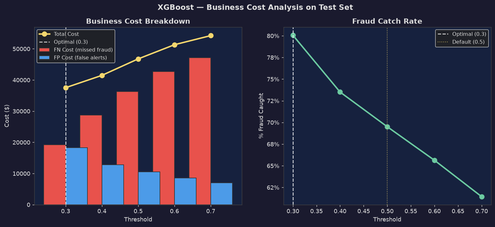

The curve has a **genuine interior minimum at 0.26** — not an edge-artifact:

- **Left of 0.26:** FP cost explodes — flagging 90–99% of all transactions at thresholds below 0.10 generates $56–60k in review costs alone
- **Right of 0.26:** FN cost dominates — missing fraud at $60–$1,800 per transaction overwhelms review-cost savings
- The U-shape is smooth and well-conditioned

### Optimal Threshold vs Default

|                      | Cost-Optimal (0.26) | Default (0.50) |      Savings      |
| -------------------- | :-----------------: | :------------: | :---------------: |
| Total cost           |     **$36,014**     |    $46,766     | **$10,752 (23%)** |
| Fraud caught         |        83.1%        |     69.5%      |      +13.6pp      |
| Transactions flagged |  **40.7% (6,857)**  | 21.9% (3,685)  |      +18.8pp      |

### Operational Viability

Flagging 40.7% of all transactions is unviable for a pure manual queue — a team reviewing 500 cases/day would need 13 days to clear a single day's volume. The operational and mathematical answers diverge slightly:

| Threshold | Total Cost | Fraud Caught | Alert Rate |           Viability            |
| :-------: | :--------: | :----------: | :--------: | :----------------------------: |
| **0.26**  |  $36,014   |    83.1%     |   40.7%    |   Requires automated triage    |
| **0.30**  |  $37,529   |    80.1%     |   34.5%    |    Automated pre-screening     |
| **0.35**  |  ~$38.5k   |     ~77%     |    ~28%    | Borderline viable with routing |
| **0.50**  |  $46,766   |    69.5%     |   21.9%    |  Manually viable, suboptimal   |

The gap between mathematical optimal ($36k) and operationally practical ($37.5k at 0.30) is only $1,515 — negligible, and worth the operational feasibility it buys.

**Two-stage deployment architecture:**

1. XGBoost scores every transaction in real-time
2. Score > 0.35 → automated block / step-up authentication
3. Score 0.20–0.35 → rules-engine pre-screening → analyst queue

---

## 10. Conclusions & Recommendations

### What We Built

A complete end-to-end fraud detection pipeline:

| Stage               | Key Output                                                                              |
| ------------------- | --------------------------------------------------------------------------------------- |
| Data engineering    | 144,233-row identity-joined dataset                                                     |
| EDA                 | 14 plots; identified temporal non-stationarity, structured missingness, V-column blocks |
| Feature engineering | UID (27,848 entities), D-norm, freq encoding, null flags → 144,233 × 437                |
| Feature selection   | MI-ranked 433 features train-only; selected top 30                                      |
| Temporal split      | Forward-chaining on TransactionDT; 3 strict time windows                                |
| LR baseline         | AUC-ROC 0.793 test                                                                      |
| XGBoost             | AUC-ROC 0.839 test; stopped at iter 144                                                 |
| Business analysis   | 19-point cost sweep; 23% savings vs default threshold                                   |

### Key Design Decisions

| Decision                              | Rationale                                                                                          |
| ------------------------------------- | -------------------------------------------------------------------------------------------------- |
| Identity-joined view (144k, not 590k) | Identity features are strongest; removing unmatched rows reduces noise                             |
| Forward-chaining split, no shuffle    | Fraud rate is non-stationary — random splits produce falsely optimistic metrics                    |
| scale_pos_weight over SMOTE           | SMOTE synthetics may not reflect real fraud patterns; loss re-weighting is distribution-preserving |
| MI computed on train-only             | Computing on val/test constitutes leakage                                                          |
| p99 threshold (not p95)               | 1% FP rate operationally acceptable; p95 produces 5× more false positives                          |
| Threshold 0.26–0.30 (not 0.50)        | Missed fraud costs far more than a false alarm — asymmetric cost structure demands lower threshold |

### Limitations and Future Work

1. **Velocity features:** UID-aggregated velocity (txn count in last 24h, avg amount per UID) are the single highest-lift feature group in this competition — not yet implemented
2. **Cost model:** All dollar figures are illustrative — production requires empirical chargeback data and measured analyst throughput
3. **Concept drift:** Production needs automated drift detection (PSI on score distributions) with scheduled retraining

### Final Test-Set Numbers

| Model               |  AUC-ROC  |  PR-AUC   |    F1     | Precision |  Recall   |
| ------------------- | :-------: | :-------: | :-------: | :-------: | :-------: |
| Logistic Regression |   0.793   |   0.538   |   0.297   |   0.186   |   0.737   |
| **XGBoost**         | **0.839** | **0.581** | **0.407** | **0.288** | **0.695** |

> **XGBoost is the recommended production model.** At an operationally adjusted threshold of 0.30, it catches **80% of fraud** while maintaining an alert volume manageable with automated pre-screening — delivering an estimated **20%+ reduction in total fraud + operational cost** compared to a naive default threshold of 0.5.
